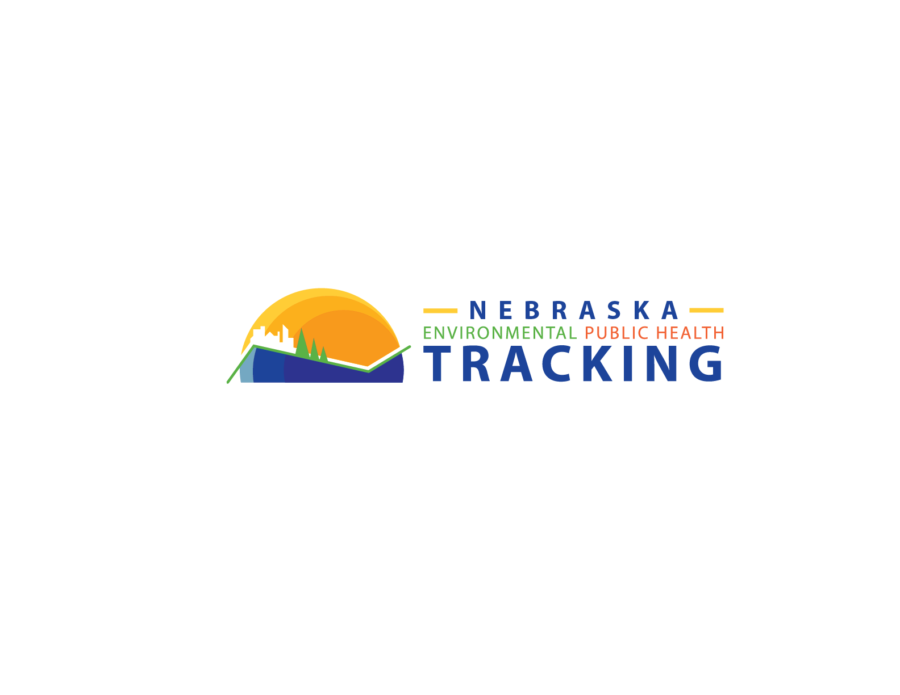

# Nebraska EPHTracking

This repository is part of thee **Nebraska EPHTracking** project. It initially contains the codes that were developed in response to the Spring 2023 data call of CDC Tracking. It was the first presence of Nebraska in this program. With more data calls this repository will be also improved.

Later, it may include other related codes for this project.

## Overview

The **Project Name** is a [brief description of the project and its purpose]. It provides [key features or functionalities]. The goal of this project is to [describe the objectives or goals].

## Structure of the Repository 

To use the **Project Name** project, follow these steps:

- ***Guidelines:*** Contains documents to be followed for data submissions
- ***Codes:*** Includes codes in R and Python
- ***notebooks:*** includes python jupyter notebooks, or .Rmd notebooks
- ***reports*** is populated with the reports created by codes in ***codes*** folder
- ***numbers*** include standard tables (e.g. analytes codes with their LDL and MCL values) that will be used frequently.

## Disclaimer

**Please note that the use of this code is at your own risk. The authors and contributors of this project assume no responsibility or liability for any errors or consequences resulting from the use of the code.**

**Last Update:** Nov 3th, 2023 for cleaning and preparing Birth Defects data for submission to the Fall Data Call